# Lab 2 - Vue 3 Admin Panel

## Опис

Міні-адмінка на Vue 3 (Composition API) з демонстрацією ключових механізмів взаємодії між компонентами та маршрутизації.

---


## Кроки запуску

1. Клонувати репозиторій:

```bash
git clone <URL>
```

2. Перейти в папку проекту

```bash
cd lab2
```

3. Встановити залежності:

```bash
npm install
```

4. Запустити локальний сервер:

```bash
npm run dev
```

5. Відкрити у браузері:

```bash
http://localhost:5173
```
# Скріншоти
## Головна
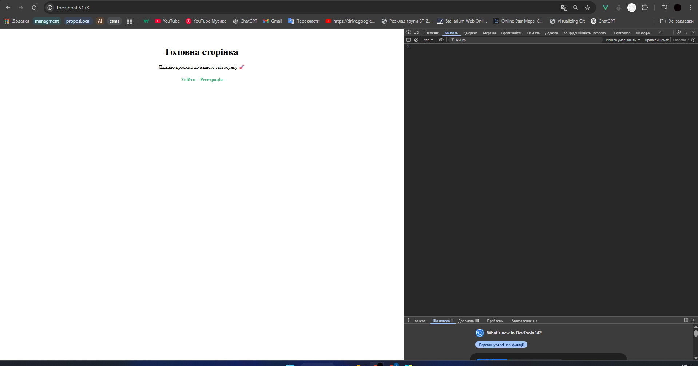
## Реєстрація
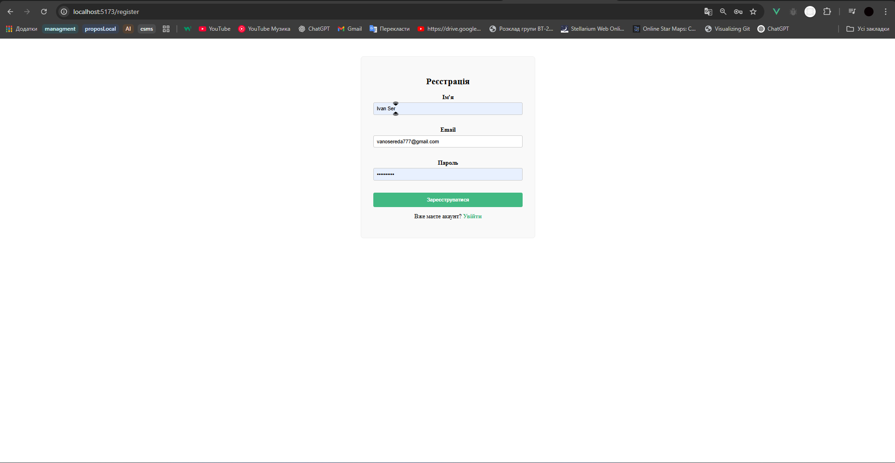
## Реєстрація успішна
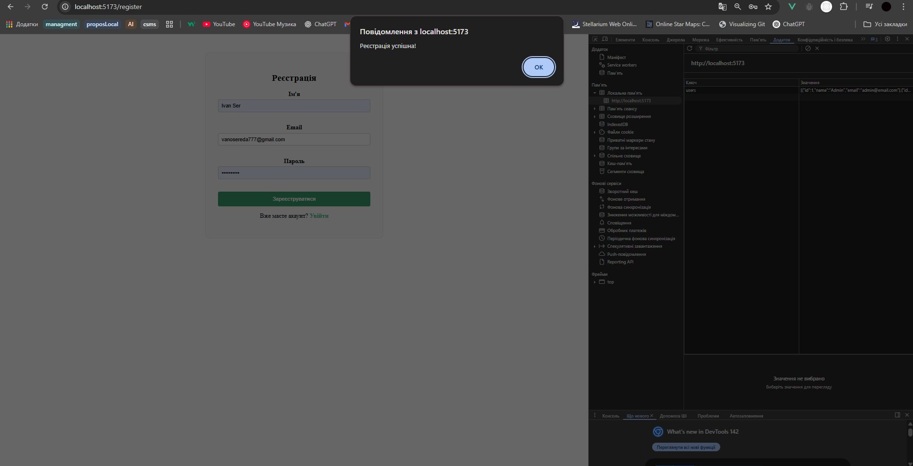
## Аутентифікація та редірект на Dashboard 
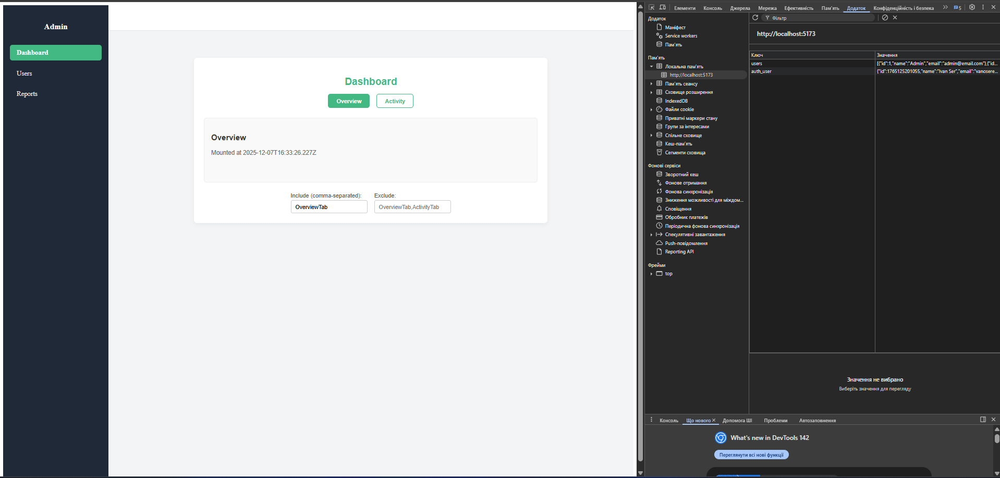
## Час рендерингу Activity tab
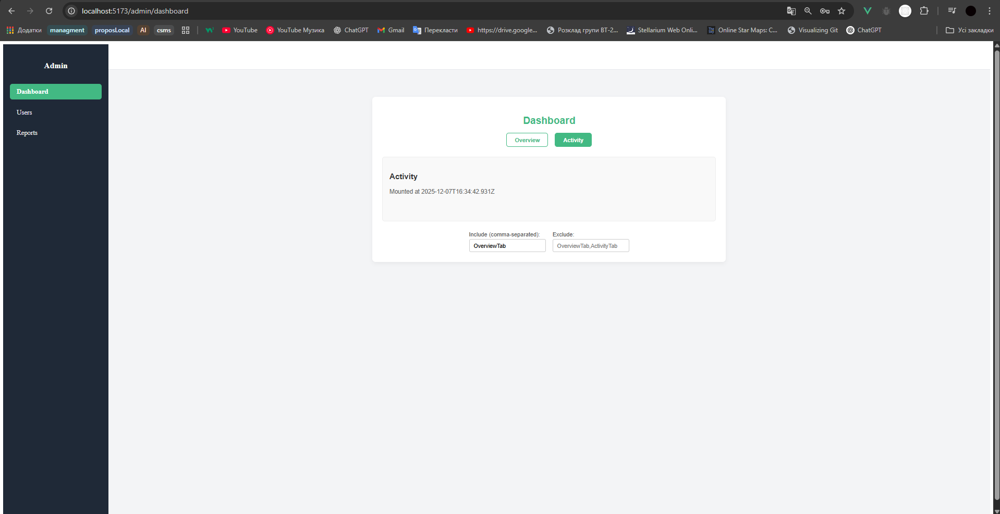
## Збережений час рендерингу Overview tab(Keep alive)
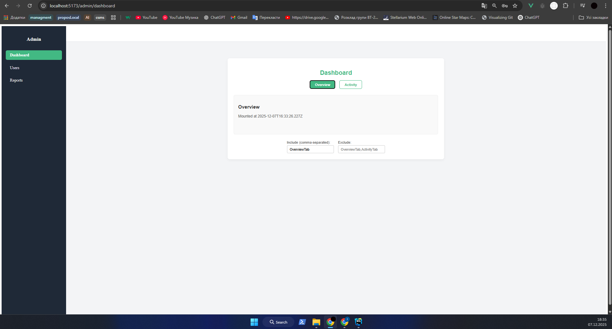
## Users page 
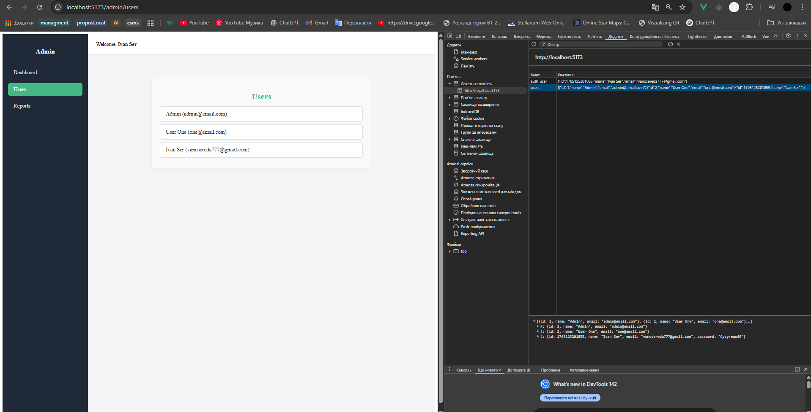
## User detail
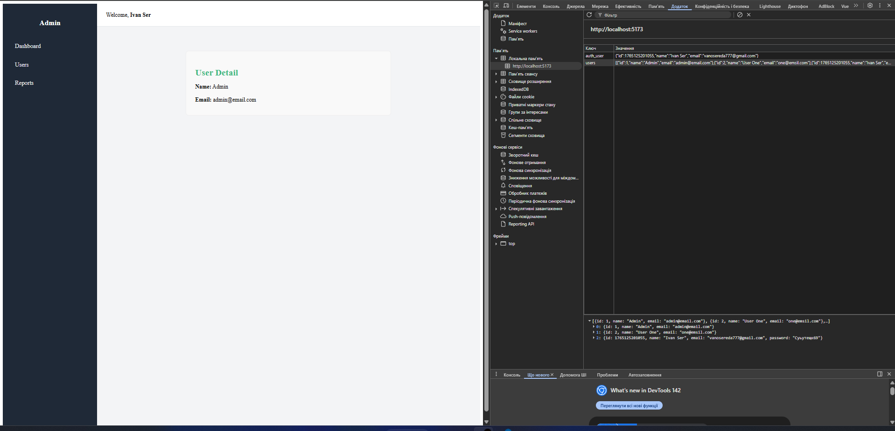
## Reports page
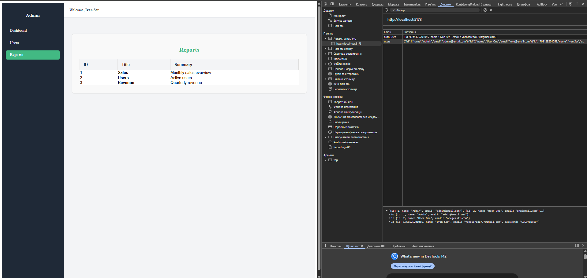
## Login мін валідація
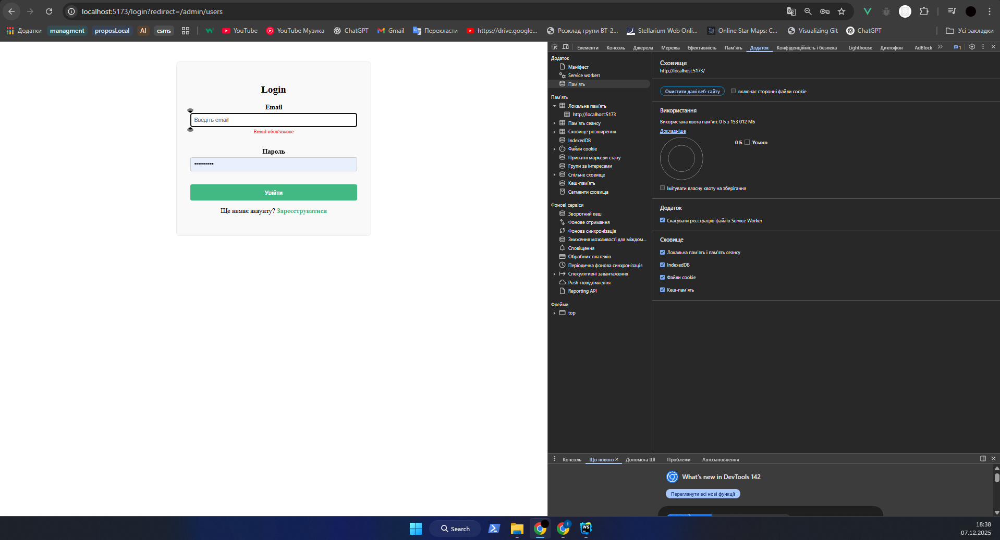
## Invalid login
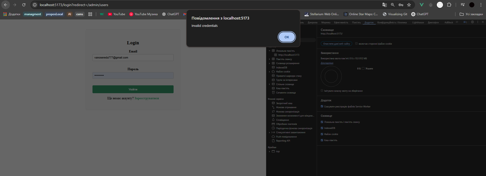
## Успішний логін і автентифікація
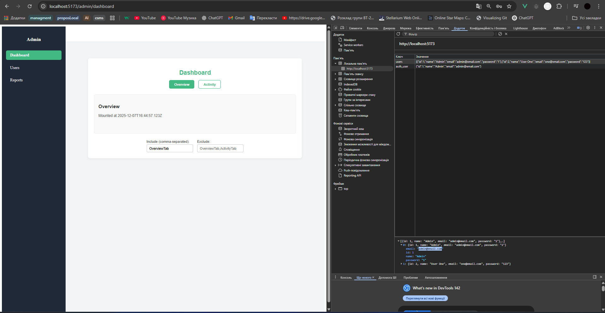
## 404 page
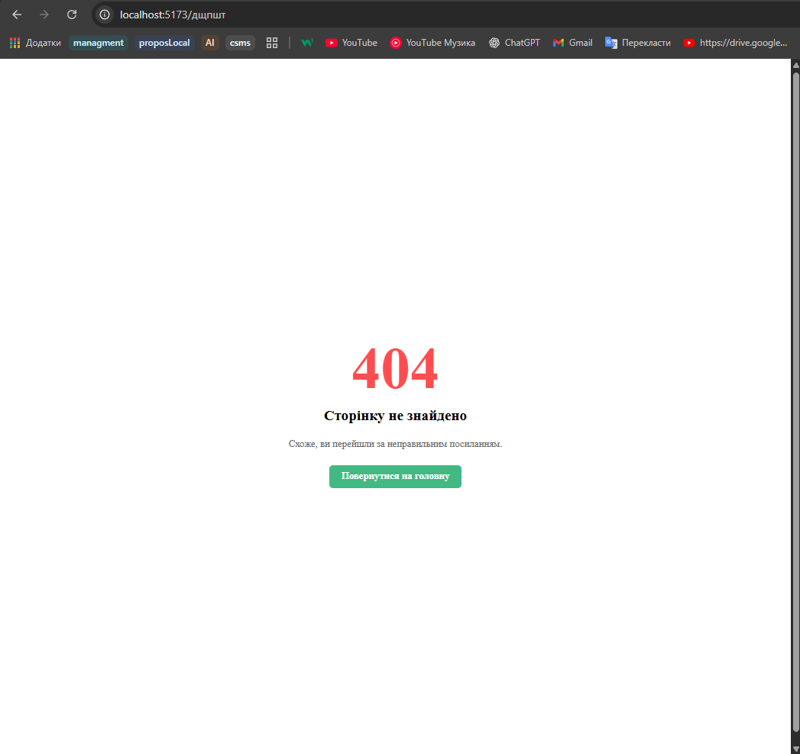


## Використані механізми Vue

### 1. **props / emits**
Використовуються у `BaseInput` та `ReportsTable` для передачі даних від батьків до дочірніх компонентів та навпаки.

**Приклад BaseInput.vue:**
```vue
<template>
  <div>
    <label :for="id">{{ label }}</label>
    <input :id="id" :type="type" :value="modelValue" @input="$emit('update:modelValue', $event.target.value)" />
    <p v-if="error" class="error">{{ error }}</p>
  </div>
</template>

<script setup>
defineProps({
  label: String,
  id: String,
  type: { type: String, default: 'text' },
  modelValue: String,
  error: String
})
</script>
```
Приклад ReportsTable.vue (scoped slot):
```vue
<template>  
<table>
    <tbody>
      <template v-for="item in items" :key="item.id">
        <slot name="row" :item="item">
          <tr>
            <td>{{ item.id }}</td>
            <td>{{ item.title }}</td>
            <td>{{ item.summary }}</td>
          </tr>
        </slot>
      </template>
    </tbody>
  </table>
</template>

<script setup>
defineProps({ items: Array })
</script>
```
2. v-model / defineModel

Двосторонній зв’язок між формами Login/Register і компонентом BaseInput.
```vue
<BaseInput v-model="form.email" label="Email" id="email" type="email" />
<BaseInput v-model="form.password" label="Password" id="password" type="password" />
```
3. provide / inject

AdminLayout.vue передає authState через provide, дочірні компоненти читають через inject.
```vue 
// AdminLayout.vue
import { provide, reactive } from 'vue'
const authState = reactive({ user: { name: 'Ivan' } })
provide('authState', authState)

// Sidebar.vue
import { inject } from 'vue'
const authState = inject('authState')

```
4. Слоти (slots)

AuthWrapper – обгортка для Login/Register

ReportsTable – scoped-slot для кастомного рендерингу рядків

```vue
<AuthWrapper title="Login">
  <form> ... </form>
</AuthWrapper>

<ReportsTable :items="items">
  <template #row="{ item }">
    <tr>
      <td>{{ item.id }}</td>
      <td><strong>{{ item.title }}</strong></td>
      <td>{{ item.summary }}</td>
    </tr>
  </template>
</ReportsTable>

```
5. KeepAlive

У Dashboard.vue збереження стану вкладок Overview / Activity.

```vue 
<KeepAlive :include="['OverviewTab']" :exclude="[]" :max="2">
  <component :is="currentComponent" />
</KeepAlive>
```
6. Роутинг (Vue Router 4)

Default + named toolbar: RouterLink у AdminLayout

Lazy-loading: асинхронне завантаження компонентів

Guards: beforeEach для перевірки requiresAuth

```vue
{
  path: '/admin/dashboard',
  component: () => import('@/pages/admin/Dashboard.vue'),
  meta: { requiresAuth: true }
}

router.beforeEach((to, from, next) => {
  const user = JSON.parse(localStorage.getItem('auth_user') || 'null')
  if (to.meta.requiresAuth && !user) next('/login')
  else next()
})
```
## Маршрути

| Path             | Component   | Meta         |
|------------------|-------------|--------------|
| /                | Home        | public       |
| /login           | Login       | public       |
| /register        | Register    | public       |
| /admin           | AdminLayout | requiresAuth |
| /admin/dashboard | Dashboard   | requiresAuth |
| /admin/users     | Users       | requiresAuth |
| /admin/user/:id  | UserDetail  | requiresAuth |
| /admin/reports   | Reports     | requiresAuth |
| /:pathMatch(.*)* | NotFound    | public       |

