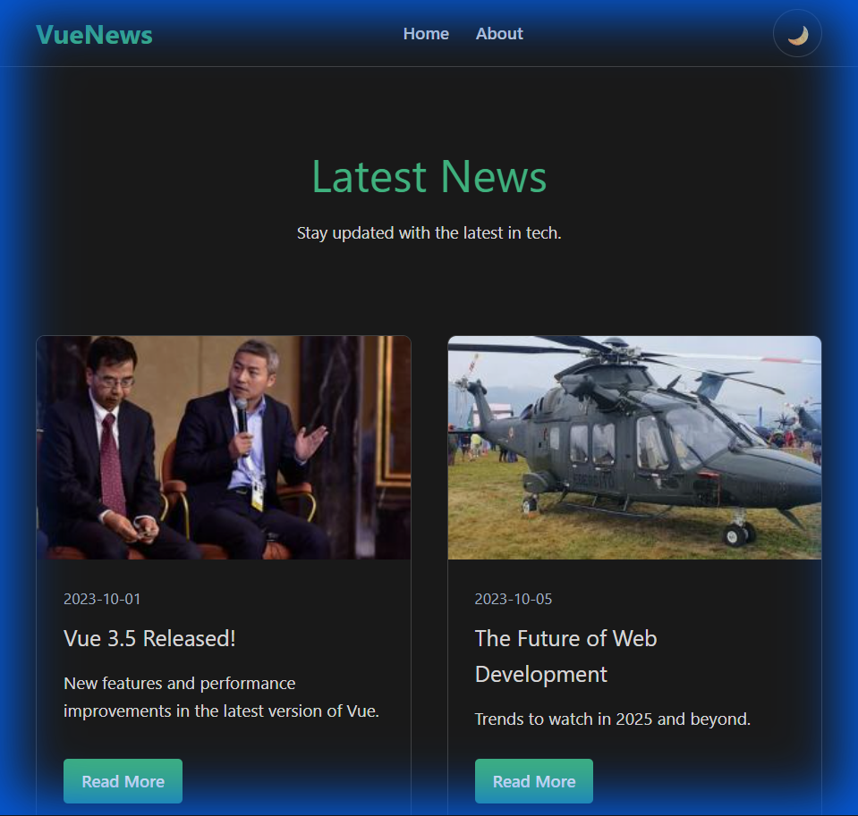
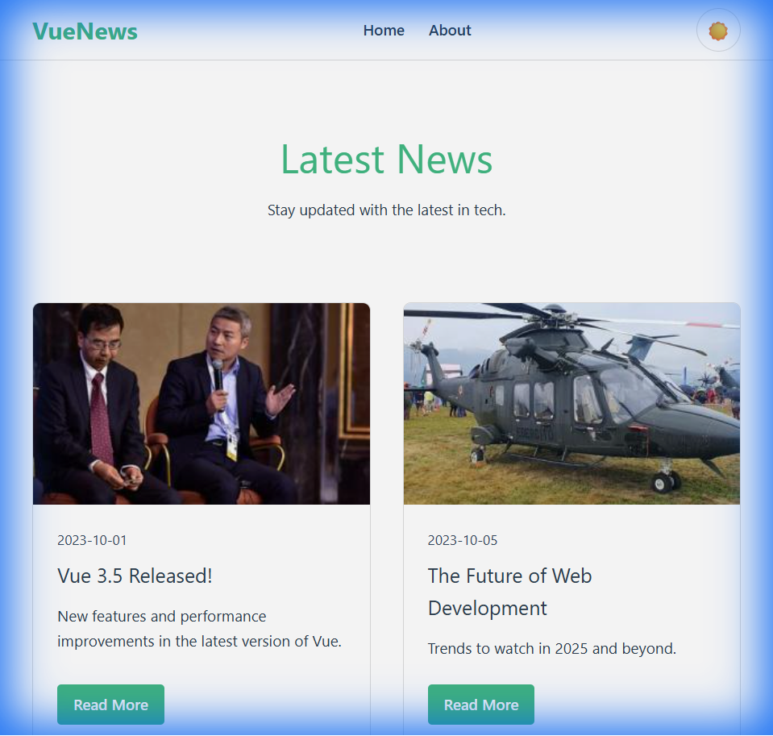
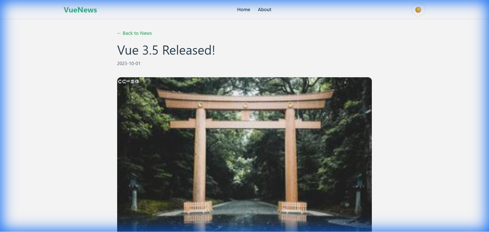
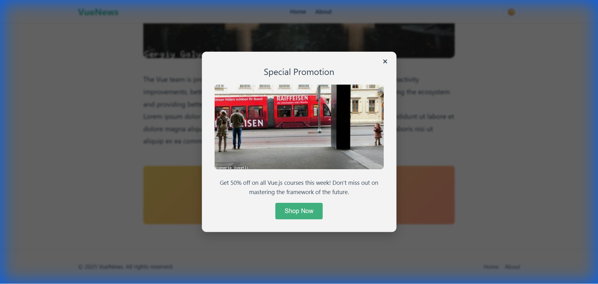
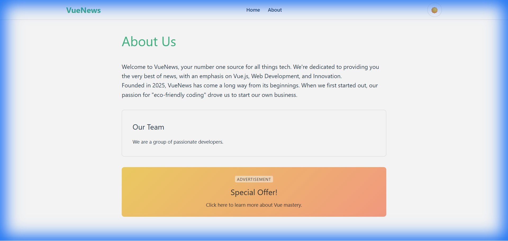

# Lab 3 - Робота з Vue SFC стилями та анімаціями

## Опис

Проєкт закріплює знання по роботі з Vue SFC стилями (scoped, CSS Modules, v-bind() у CSS), анімаціями переходів та використанням `<Teleport>`.
Реалізовано міні-сайт новин з перемикачем тем, модальними вікнами та роутингом.

---

## Кроки запуску

1. Встановити залежності:

```bash
npm install
```

2. Запустити локальний сервер:

```bash
npm run dev
```

3. Відкрити у браузері:

```bash
http://localhost:5173
```

---

## Структура сайту

Сайт включає наступні секції:

- **Header** — логотип, навігація та перемикач теми (Light/Dark).
- **Home** — головна сторінка зі списком новин (Grid Layout).
- **Article** — сторінка детального перегляду новини з динамічним контентом.
- **About** — інформаційна сторінка про проект.
- **Modal** — модальне вікно реклами, що викликається кліком на банер.

---

## Технології та Компоненти

### Основні інструменти:
- **Vue 3 (Composition API)**
- **Vue Router 4**
- **Vite**

### Реалізовані техніки:

1. **Стилізація**:
   - `<style scoped>` — для ізоляції стилів компонентів (Header, Views).
   - **CSS Modules** — використано у компоненті `NewsCard.vue` для демонстрації модуляризації.
   - **CSS змінні** — для реалізації перемикача тем (Light/Dark modes).

2. **Анімації та Переходи**:
   - `<Transition>` — додано для плавного переходу між сторінками маршрутизатора.
   - Анімоване відкриття/закриття модального вікна.

3. **Teleport**:
   - Використано для рендеру модального вікна (`BaseModal.vue`) безпосередньо в `<body>`, поверх іншого контенту.

---

## Скріншоти


*Головна сторінка зі світлою темою*


*Перемикання на темну тему*


*Детальний перегляд новини*


*Відкрите модальне вікно реклами*


*Сторінка "About"*

---

## Особливості реалізації

### 1. Перемикач теми
Реалізовано через CSS змінні та `localStorage`. Стан зберігається між перезавантаженнями.

```javascript
/* Збереження стану теми */
if (isDark.value) {
  document.documentElement.setAttribute('data-theme', 'dark')
  localStorage.setItem('theme', 'dark')
}
```

### 2. CSS Modules
Компонент `NewsCard` використовує CSS Modules для уникнення конфліктів назв класів.

```vue
<template>
  <div :class="$style.card">
    <!-- ... -->
  </div>
</template>

<style module>
.card { /* ... */ }
</style>
```

### 3. Модальне вікно (Teleport)
Модалка рендериться за межами DOM-структури батьківського компонента, що дозволяє уникнути проблем з `z-index`.

```vue
<Teleport to="body">
  <Transition name="modal">
    <div v-if="isOpen" class="modal-overlay"> ... </div>
  </Transition>
</Teleport>
```
