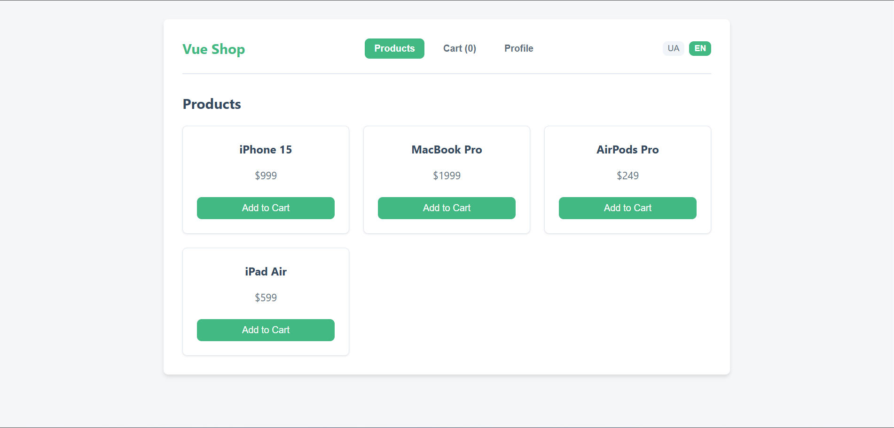
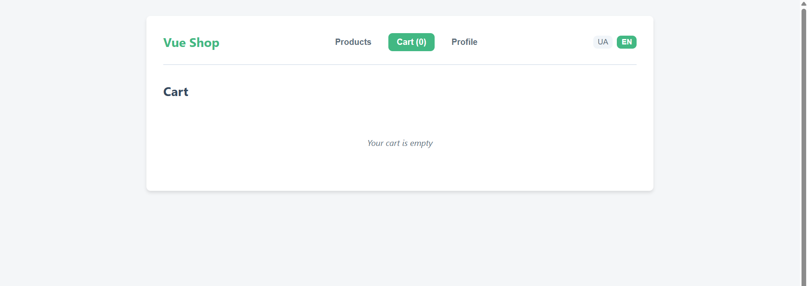
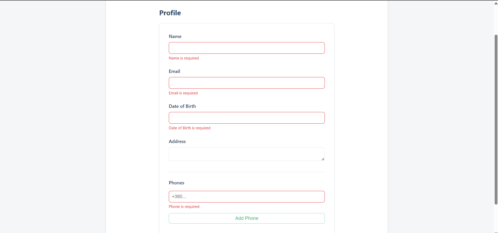
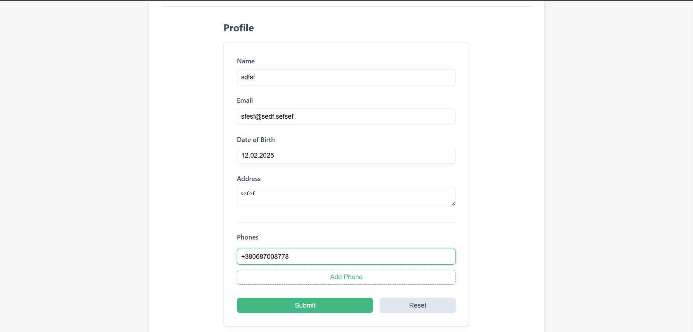
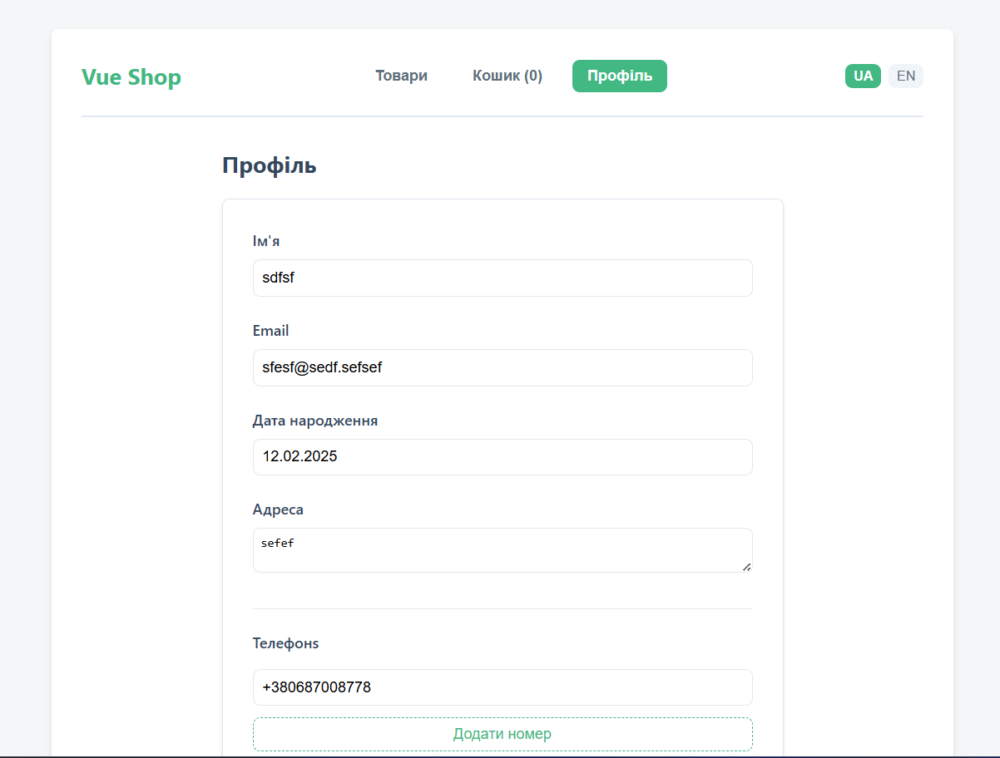
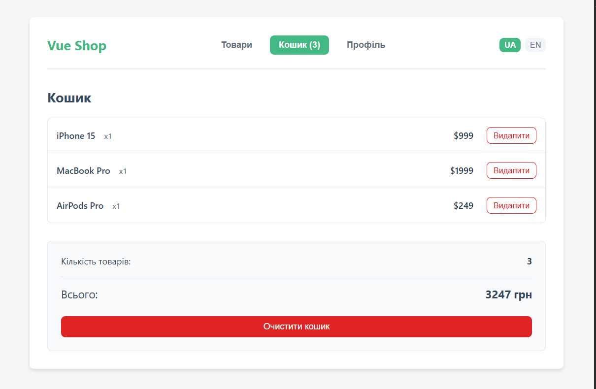
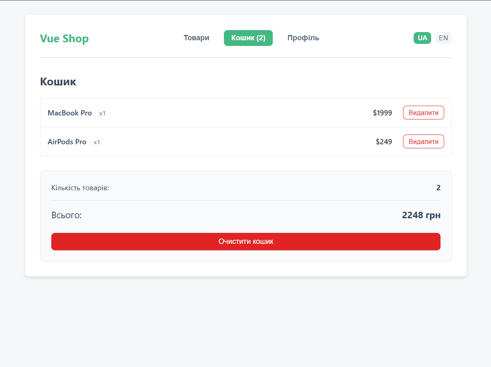
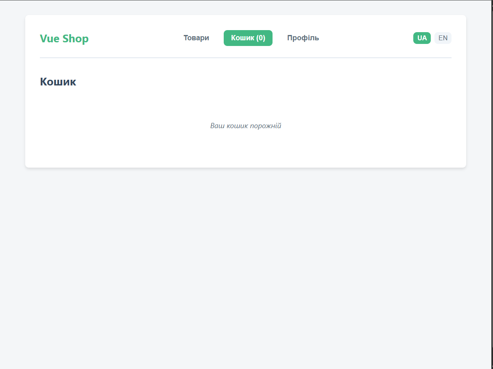
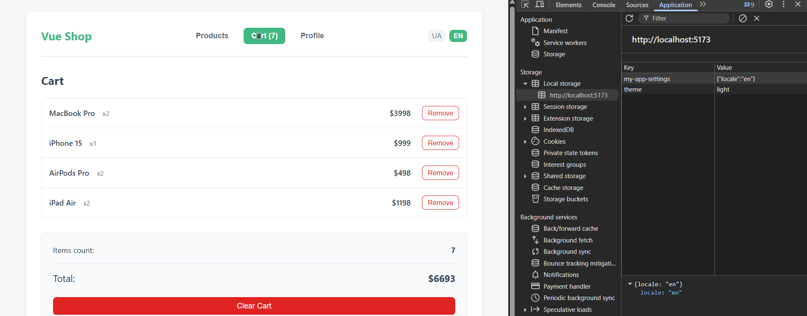

# Lab 4 - Vue 3 Profile & Cart Setup

## Опис

Міні-застосунок, розроблений на Vue 3 (Composition API) з використанням Pinia для керування станом, i18n для локалізації та VeeValidate для складних форм. Проект демонструє налаштування персистентності стану, динамічні форми та валідацію.

---

## Кроки запуску

1. Клонувати репозиторій:

```bash
git clone <URL>
```

2. Перейти в папку проєкту

```bash
cd lab4
```

3. Встановити залежності:

```bash
npm install
```

4. Запустити локальний сервер:

```bash
npm run dev
```

5. Відкрити у браузері:

```bash
http://localhost:5173
```

# Скріншоти
_(Зображення розміщені в папці `readme_images`. Якщо ви щойно запустили проект, додайте скріншоти відповідно до структури нижче)_

## Головна (Products)

## Кошик (Cart) пустий

## Профіль (Profile) - Валідація

## Профіль (Profile) - Успішне заповнення

## Профіль (Profile) - Зміна на українську мову

## Профіль (Profile) - Кошик з товарами

## Профіль (Profile) - Кошик видаення одного товару

## Профіль (Profile) - Кошик видаення всіх товарів

## Профіль (Profile) - Зміна на англійську мову запис в lcalstorage

---

## Використані механізми Vue

### 1. **Pinia & Persistence**
Використовується для глобального зберігання стану налаштувань (мова) та кошика. Плагін `pinia-plugin-persistedstate` забезпечує збереження мови після перезавантаження сторінки.

**Приклад `stores/settings.js`:**
```javascript
export const useSettingsStore = defineStore('settings', () => {
    const locale = ref('ua')
    function setLocale(newLocale) { /* ... */ }
    return { locale, setLocale }
}, {
    persist: {
        key: 'my-app-settings',
        pick: ['locale']
    }
})
```

### 2. **vue-i18n & Modifiers**
Локалізація інтерфейсу (UA/EN). Використовується `createI18n` та синхронізація з Pinia через `watch` у `main.js`. Також реалізовані власні модифікатори.

**Синхронізація (`main.js`):**
```javascript
watch(() => settings.locale, (newLocale) => {
  i18n.global.locale.value = newLocale
})
```

### 3. **VeeValidate & Yup**
Використовується для побудови форми профілю з валідацією. `useFieldArray` дозволяє динамічно додавати поля телефонів.

**Приклад форми (`ProfileView.vue`):**
```javascript
const schema = computed(() => {
  return yup.object({
    name: yup.string().required(...),
    phones: yup.array().of(yup.string().required(...))
  })
})
```

### 4. **Dynamic Components (KeepAlive)**
Замість складного роутингу в цій лабораторній використано динамічне перемикання компонентів з `KeepAlive` для збереження стану (наприклад, введених даних у формі при перемиканні на кошик).

```html
<KeepAlive>
  <component :is="currentTab === 'products' ? ProductsView : currentTab === 'cart' ? CartView : ProfileView" />
</KeepAlive>
```

### 5. **Props / Emits & Slots**
Використання слотів для компонентів `Field` від VeeValidate дозволяє кастомізувати відображення полів введення та помилок.

```html
<Field name="email" v-slot="{ field, errorMessage }">
  <input v-bind="field" :class="{ error: errorMessage }" />
  <span class="error-msg" v-if="errorMessage">{{ errorMessage }}</span>
</Field>
```
