# Lab 5 - Використання інтерфейсних бібліотек (PrimeVue). Створення плагінів у Vue.js

## Опис

Проєкт демонструє використання інтерфейсної бібліотеки PrimeVue v4 у Vue 3 та створення власного плагіна.
Реалізовано лендінг з основними секціями та інтерактивними компонентами.

---

## Кроки запуску

1. Клонувати репозиторій:

```bash
git clone <URL>
```

2. Перейти в папку проекту

```bash
cd lab5
```

3. Встановити залежності:

```bash
npm install
```

4. Запустити локальний сервер:

```bash
npm run dev
```

5. Відкрити у браузері:

```bash
http://localhost:5173
```

---

## Структура лендінгу

Лендінг включає наступні секції:

- **Header** — верхнє меню з навігацією, кнопками та мобільним меню (Drawer).
- **Hero** — головний банер з закликом до дії.
- **Проблема–Рішення** — опис проблем користувача та рішення.
- **Переваги** — ключові плюси продукту з іконками.
- **Як це працює** — покроковий гайд використання продукту.
- **Тарифи / Плани** — порівняння тарифних планів з калькулятором вартості.
- **Відгуки** — реальні відгуки користувачів з рейтингами.
- **FAQ** — відповіді на популярні питання (Accordion).
- **Контактна форма** — форма для зворотного зв'язку з валідацією.
- **Footer** — інформація про компанію, контакти та посилання.

---

## Використані компоненти PrimeVue v4

### Основні компоненти:

- **Button** — кнопки у Header, Hero, мобільному меню та формах
- **Drawer** — мобільне меню у Header (замість deprecated Sidebar)
- **Card** — картки у секціях Переваги, Тарифи, Відгуки
- **Accordion / AccordionPanel / AccordionHeader / AccordionContent** — FAQ секція (нова структура v4)
- **InputNumber** — поле введення кількості у калькуляторі тарифів
- **Chip** — відображення популярного тарифу
- **InputText** — текстові поля у контактній формі
- **InputTextarea** — багаторядкове поле для повідомлень
- **Dropdown** — випадаючий список у формах
- **Checkbox** — чекбокси у формах
- **Toast / ToastService** — повідомлення користувачу

---

## Налаштування PrimeVue v4

```javascript
import PrimeVue from 'primevue/config'
import Aura from '@primeuix/themes/aura'
import ToastService from 'primevue/toastservice'

app.use(PrimeVue, {
  theme: {
    preset: Aura,
    options: {
      darkModeSelector: '.dark-mode'
    }
  }
})
app.use(ToastService)
```

# Скріншоти

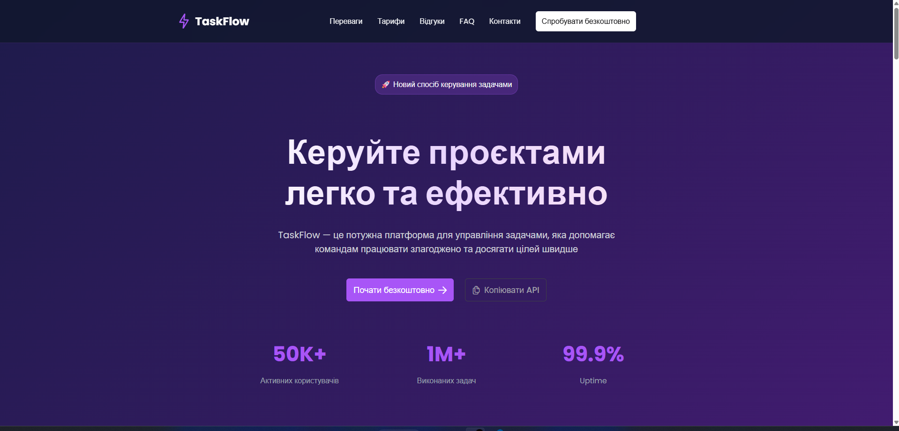
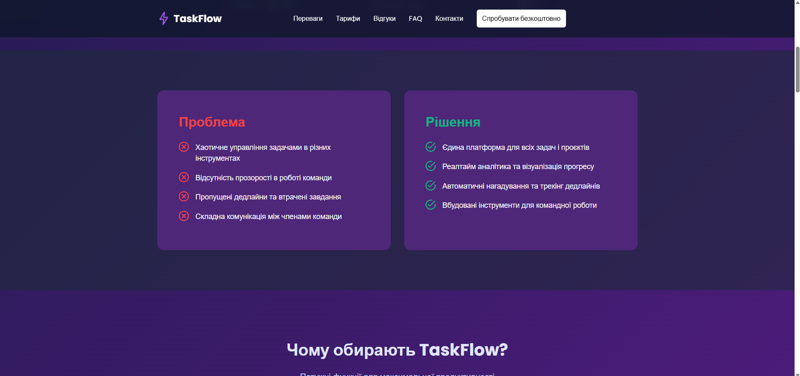
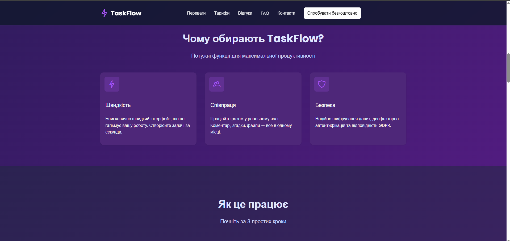
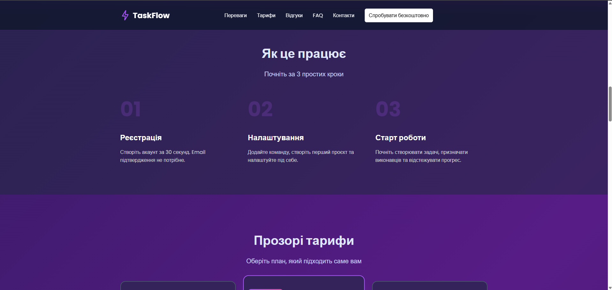
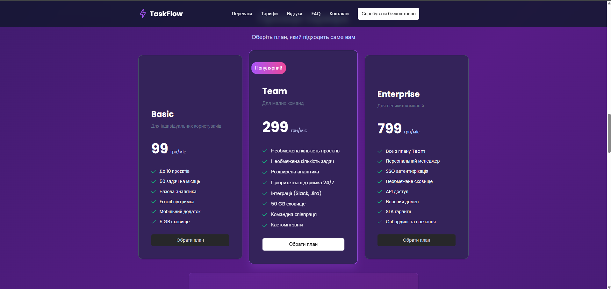
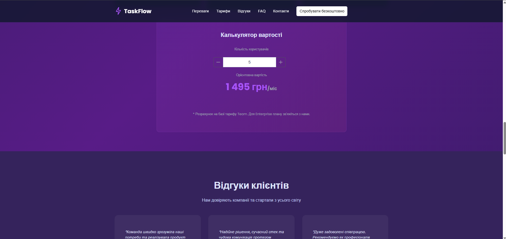
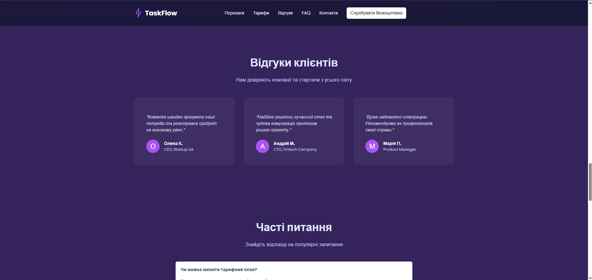
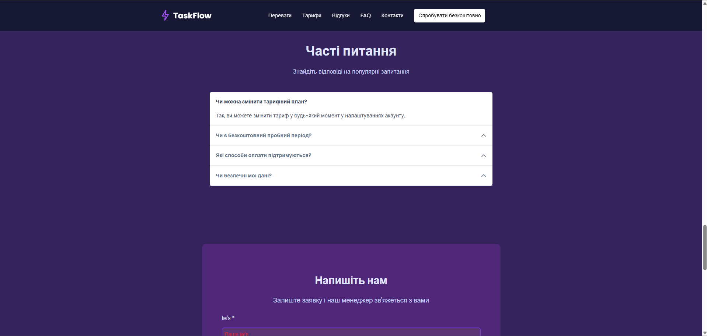
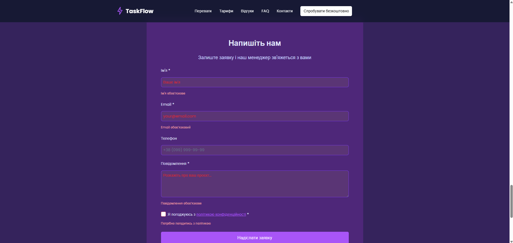
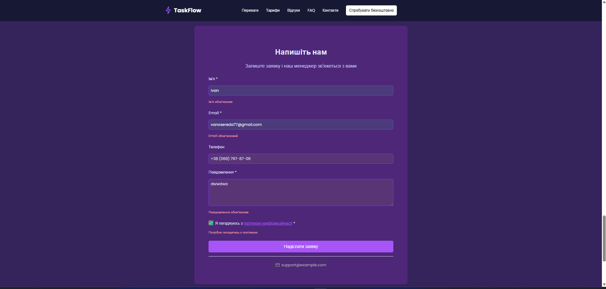
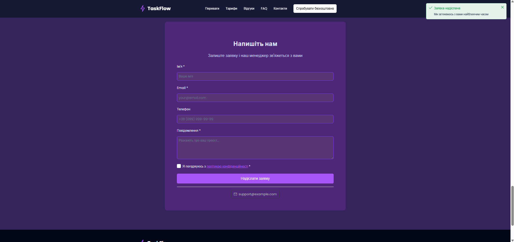
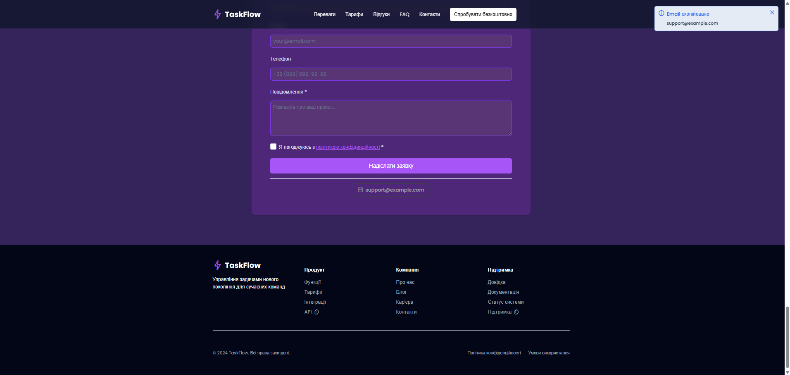
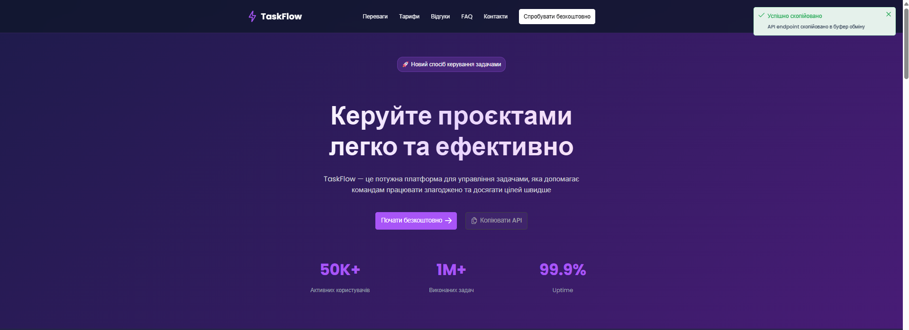

**Особливості налаштування:**

- Використовується тема **Aura** з підтримкою Dark Mode
- Підключено **ToastService** для відображення повідомлень
- Застосовано кастомізацію кольорів через CSS змінні

---

## CopyToClipboardPlugin

Власний плагін для копіювання тексту в буфер обміну.

### Підключення у main.js:

```javascript
import CopyToClipboardPlugin from './plugins/copyToClipboard'
app.use(CopyToClipboardPlugin)
```

### Використовується у таких секціях:

- **Тарифи / Плани** — копіювання промокодів або реквізитів
- **Контактна форма** — копіювання електронної пошти або телефону
- **Footer** — копіювання контактної інформації

### Виклик плагіна:

```javascript
this.$copyToClipboard(value)
```

Копіює конкретні значення, передані у параметрі `value`, та показує Toast-повідомлення про успішне копіювання.

---

## Особливості реалізації

### 1. Калькулятор вартості
У секції Тарифи реалізовано інтерактивний калькулятор:
- Використовує **InputNumber** з кнопками +/-
- Автоматично розраховує вартість на основі кількості користувачів
- Валідація мінімального (1) та максимального (100) значення
```vue
<header class="header">
  <div class="logo">
    <i class="pi pi-bolt"></i>
    <span>TaskFlow</span>
  </div>

  <nav class="desktop-nav">
    <a href="#features">Переваги</a>
    <a href="#pricing">Тарифи</a>
    <Button label="Спробувати безкоштовно" severity="contrast" />
  </nav>

  <Button
      icon="pi pi-bars"
      text
      class="mobile-menu-btn"
      @click="visible = true"
  />

  <Sidebar v-model:visible="visible" position="right">
    <h3>Меню</h3>
    <div class="mobile-menu">
      <a href="#features" @click="visible = false">Переваги</a>
      <a href="#pricing" @click="visible = false">Тарифи</a>
      <Button label="Спробувати безкоштовно" severity="contrast" 
              class="w-full" @click="visible = false" />
    </div>
  </Sidebar>
</header>
```

### 2. Адаптивний дизайн
- Мобільне меню реалізоване через **Drawer**
- Гріди автоматично перебудовуються на менших екранах
- Оптимізація для планшетів та мобільних пристроїв


### 3. Темізація
- Кастомні кольори через CSS змінні PrimeVue
- Градієнти та анімації для покращення UX
- Підтримка темної теми через клас `.dark-mode`


